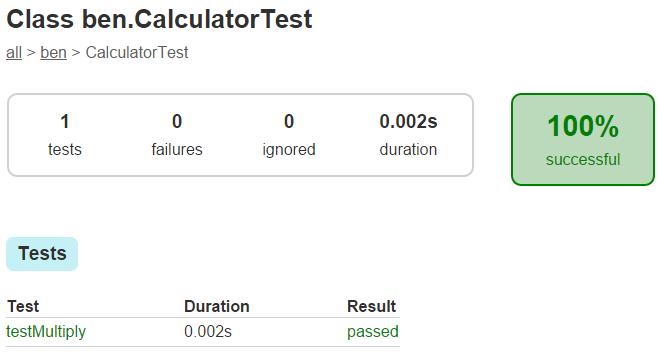
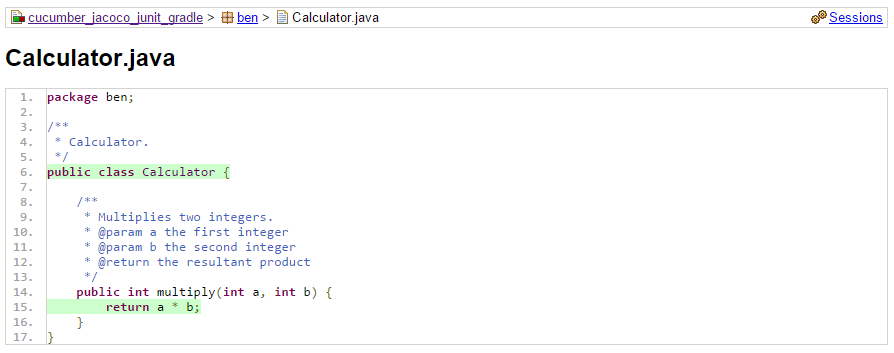

# Cucumber, JaCoCo and JUnit with Gradle
Sample Gradle project with Cucumber and JUnit tests covered by JaCoCo.

## Overview
To meet a high safety standard, a piece of software should have high and potentially low level software requirements, assuming these requirements are validated, once verified, the quality of the software should be good.

The goal of this sample project is to show how the high and low level requirements can be captured and how to automate the verification process, it also shows how to validate that the requirements are complete by checking if there is any code that does not get executed when all the requirements are tested.

This sample project does not yet contain the infrastructure to trace the requirements.

## High Level Requirements
The first step in developing safe software is to gather high level software requirements.
High level requirements will be captured in Cucumber Gherkin scripts and will describe how the piece of software as a whole should behave.
Cucumber has the advantage that they are more than just requirements; they are specifications that can be executed.

``` gherkin
Feature: Calculator

  Scenario Outline: Multiply two integers
    When the system is run with arguments <a> and <b>
    Then the system displays <product>

    Examples:
      | a  | b  | product |
      |  6 |  7 |  42     |
```

## Low Level Requirements
Once the high level requirements have been written, software design can be performed.
Software design should produce two documents: the design doc and the low level software requirements.
The design doc normally splits the software into units and describes how the interact with each other, it is these interactions that dictate the requirements of the software units.
Low level requirements will be tested using JUnit.

``` java
@Test
public void testMultiply() {
    int actualProduct = calculator.multiply(6, 7);
    assertEquals("Product should be 42", 42, actualProduct);
}
```

## Validation
To help with validation, the code coverage can be measured while the software is tested, this will give some kind of confidence that the requirements are complete.
Coverage is easy to measure with JaCoCo, simply use the JaCoCo agent when running the tests.

## Gradle
There are a few tricks to bring this all together with Gradle:

### Build Output
It is a goodness to have a well structured build output; we will aim for the folder structure below. reports will contain the human readable reports (HTML) and results will contain the raw results (JSON, XML and EXEC).

```
build
 ├ reports
 |  ├ cucumber
 |  ├ jacoco
 |  └ tests
 └ results
    ├ cucumber
    ├ jacoco
    └ tests
```

### Cucumber
Use the [gradle-cucumber-plugin](https://github.com/samueltbrown/gradle-cucumber-plugin) by Samuel Brown.

The following configuration will create a HTML report, JSON results, will find the glue code and features and will run the JaCoCo agent when the features are being executed to get coverage data:
``` gradle
cucumber {
    formats = [ "pretty", "html:build/reports/cucumber", "json:build/results/cucumber/cucumber.json" ]
    glueDirs = [ "src/cucmber/java" ]
    featureDirs = [ "src/cucumber/resources" ]
    jvmOptions {
        def jacocoAgent = zipTree(configurations.jacocoAgent.singleFile).filter { it.name == "jacocoagent.jar" }.singleFile
        jvmArgs = ["-javaagent:$jacocoAgent=destfile=$buildDir/results/jacoco/cucumber.exec,append=false"]
    }
}
```

### JUnit
Use the official jacoco gradle plugin and add the following configuration to get the results in the correct folders:

``` gradle
testResultsDirName = "results/test"

test {
    jacoco {
        append = false
        destinationFile = file("$buildDir/results/jacoco/test.exec")
    }
}
```

### Coverage Report
And finally for the coverage report add:

``` gradle
jacocoTestReport {
    executionData = files("$buildDir/results/jacoco/test.exec", "$buildDir/results/jacoco/cucumber.exec")
    reports {
        xml.enabled false
        csv.enabled false
        html.destination "$buildDir/reports/jacoco"
    }
    dependsOn test
    dependsOn "cucumber"
}
```

### Running
To test the low level software requirements run:

``` bash
$ gradle test
```

This will generate some sweet results:



To test the high level software requirements run:

``` bash
$ gradle cucumnber
```

This will generate some more neat results:


To check the coverage:

``` bash
$ gradle jacocoTestReport
```

And you will know if you have incomplete requirements:


